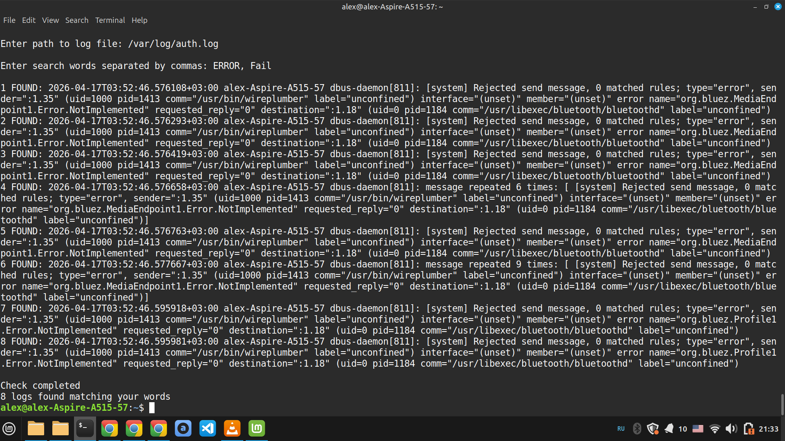

# Simple Log Analyzer (Python)

## 📌 About

This project is part of my journey into cybersecurity and SOC analysis.

The tool was developed step by step from scratch: I designed the logic, implemented the features manually, tested different scenarios, and refined the code through multiple iterations.

During development, I intentionally experimented with the code — breaking and fixing it — to better understand how log parsing and keyword analysis work in practice.

As a result, I have a solid understanding of how the tool works internally and can confidently explain its behavior and logic.

---

## 🎯 SOC Relevance

This tool simulates basic tasks performed by SOC analysts:

- Searching logs for suspicious keywords (e.g. `error`, `fail`, `kernel`)
- Identifying patterns in system activity
- Prioritizing events based on frequency
- Working with raw log data in a CLI environment

---

## ⚙️ Features

- Reads system log files (e.g. `/var/log/syslog`)
- Accepts user-defined keywords
- Case-insensitive search
- Counts occurrences per keyword
- Displays matching lines
- Sorts results by frequency (descending)

---

## ▶️ Demo

Watch the tool in action:  
👉 https://youtu.be/0NPFKR2R6Lc

---

## 📸 Screenshot



---

## 🛠️ How to run

```bash
git clone https://github.com/alex-blue-team/log_analyzer
cd log_analyzer
python3 log_analyzer_v3.py
